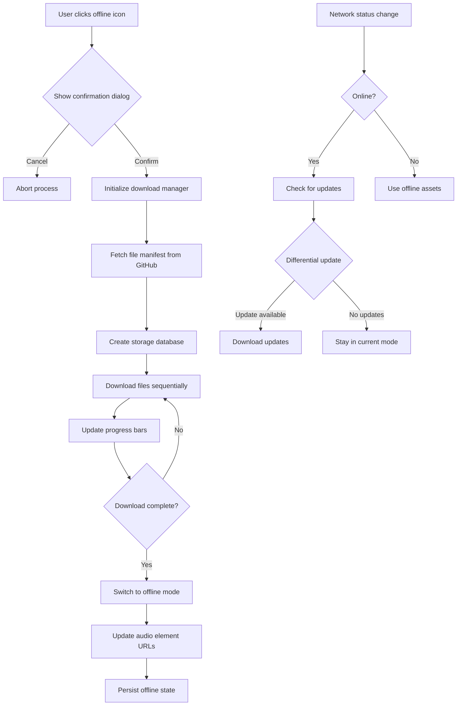

# Offline Download Functionality Implementation

## Overview

This document describes the audio file download functionality implemented for the Six Senses Meditation Course offline mode feature. The system provides two-level progress tracking, pause/resume capabilities, and retry mechanisms for downloading audio files from GitHub Releases.

## Files Created

### 1. Core Download Manager (`static/js/offline-manager.js`)
- **Purpose**: Handles the actual download logic and progress tracking
- **Features**:
  - Two-level progress tracking (overall + current file)
  - Pause/resume functionality using AbortController
  - Retry mechanism with exponential backoff (3 retries max)
  - File size estimation via HEAD requests
  - Event-based callbacks for UI updates

### 2. UI Components (`static/js/offline-ui.js` and `static/css/offline-mode.css`)
- **Purpose**: Provides user interface for download management
- **Features**:
  - Modal overlay with progress bars
  - Real-time progress updates
  - Control buttons (start, pause/resume, cancel)
  - Status messages and error handling
  - Responsive design matching the existing theme
  - Green color scheme integration with CSS variables

## Key Features Implemented

### Two-Level Progress Tracking
- **Overall Progress**: Files downloaded/total files + bytes downloaded/total bytes
- **Current File Progress**: Bytes downloaded/total bytes for the active download
- **Visual Representation**: Dual progress bars with percentage and file size displays

### Pause/Resume Functionality
- Uses `AbortController` to pause downloads
- Maintains download state to allow resuming from where it left off
- Visual indicators for paused state

### Retry Mechanism
- Automatic retry on network failures (up to 3 attempts)
- Exponential backoff between retries (1s, 2s, 3s)
- Clear error reporting for failed downloads

### GitHub Releases Integration
- Downloads from: `https://github.com/bdhrs/meditation-course-on-the-six-senses/releases/download/audio-assets/`
- Uses fetch API with proper error handling
- HEAD requests for file size estimation

## Integration with Build System

The offline download functionality integrates with the existing build system through:

### 1. Audio Files List Generation
The build system (`build.py`) already generates `audio-files.json` which contains the list of all audio files needed for offline mode. This file is used by the download manager to know which files to download.

### 2. CSS Integration
The offline mode CSS uses the same CSS variables as the main theme:
- `--primary-color`: Green progress bars
- `--background-color`: Modal background
- `--text-color`: Text colors
- `--border-color`: Borders and separators

### 3. JavaScript Integration
The offline manager can be initialized with the audio files list from `audio-files.json`:

```javascript
// Example usage
fetch('audio-files.json')
    .then(response => response.json())
    .then(audioFiles => {
        const offlineUI = new OfflineUI();
        offlineUI.initialize();
        offlineUI.setup(audioFiles);
        
        // Show UI when offline mode is requested
        offlineUI.show();
    });
```

## Usage Example

```javascript
// Basic usage
const manager = new OfflineManager();
manager.initialize(audioFilesList);

manager.setCallbacks({
    onProgress: (progress) => {
        console.log('Progress:', progress);
    },
    onComplete: () => {
        console.log('Download complete!');
    },
    onError: (error) => {
        console.error('Download error:', error);
    }
});

// Start download
await manager.startDownload();

// Pause/resume
manager.pauseDownload();
manager.resumeDownload();

// Cancel
manager.cancelDownload();
```

## Testing

A test page (`test-download.html`) is provided to verify functionality:
- Tests download from GitHub Releases
- Shows both basic console output and full UI
- Uses smaller audio files for quick testing

## Browser Compatibility

- **Chrome/Edge**: Full support (fetch, AbortController, CSS Grid/Flexbox)
- **Firefox**: Full support
- **Safari**: Full support (iOS 12+)
- **Mobile**: Responsive design works on all screen sizes

## Performance Considerations

- **Memory Usage**: Files are processed as streams to avoid large memory usage
- **Network**: Sequential downloads to avoid overwhelming connections
- **Storage**: Currently downloads to memory (Blob objects) - will integrate with IndexedDB in next phase

## Next Steps for Full Offline Mode

1. **Storage Integration**: Add IndexedDB or Cache API for persistent storage
2. **Asset Management**: Create URL rewriting system for offline/online mode switching
3. **Update Checking**: Implement version checking and differential updates
4. **Service Worker**: Enhance service worker to handle offline asset serving
5. **Error Recovery**: Add more robust error handling and recovery mechanisms

## File Sizes and Download Times

- Total audio files: ~800MB (37 files)
- Estimated download time: 20-60 minutes on average broadband
- Progress tracking helps users understand download status

## Error Handling

The system handles:
- Network failures (automatic retry)
- HTTP errors (404, 500, etc.)
- User-initiated pauses and cancellations
- Browser compatibility issues (fallbacks)

This implementation provides a solid foundation for the offline mode feature with professional-grade download management and user experience.


# Offline Mode Implementation Plan

## Overview
This document outlines the implementation plan for adding runtime offline mode functionality to the Six Senses Meditation Course website. The feature will allow users to download audio files and other assets dynamically, providing complete offline access.

## Current State Analysis

### Audio Files to Download
The website references 37 audio files from GitHub Releases:
- 01-01-coming-back-to-your-senses.mp3
- 01-02-sense-of-sight.mp3
- 01-03-sense-of-hearing.mp3
- 01-04-sense-of-smell.mp3
- 01-05-sense-of-taste.mp3
- 01-06-sense-of-touch.mp3
- 01-07-sense-of-mind.mp3
- 02-01-open-awareness.mp3
- 02-02-name-the-channel.mp3
- 02-03-dual-experiences.mp3
- 03-01-this.mp3
- 03-02-five-obstacles.mp3
- 03-03-following-experience.mp3
- 03-04-generating-interest.mp3
- 03-05-attention-to-attention.mp3
- 04-01-internal-dependency.mp3
- 04-02-external-dependency.mp3
- 04-03-conditions-for-consciousness.mp3
- 04-04-contact.mp3
- 04-06-conditioned.mp3
- 05-01-sukha-vedana.mp3
- 05-02-dukkha-vedana.mp3
- 05-03-adukkham-asukha-vedana.mp3
- 05-04-three-types-of-vedana.mp3
- 05-05-eighteen-types-of-vedana.mp3
- 05-06-craving-aversion-and-ignorance.mp3
- 05-07-cultivating-equanimity.mp3
- 06-01-recognizing-anicca.mp3
- 06-02-vedana-anicca.mp3
- 06-03-giving-up-interest-in-anicca.mp3
- 07-01-recognizing-dukkha.mp3
- 07-02-source-of-dukkha.mp3
- 07-03-giving-up-interest-in-dukkha.mp3
- 08-01-all-experience-is-anatta.mp3
- 08-02-three-types-of-anatta.mp3
- 08-03-anicca-dukkha-anatta.mp3
- 08-04-emptiness.mp3

### External Dependencies
- GitHub Releases for audio files (https://github.com/bdhrs/meditation-course-on-the-six-senses/releases/download/audio-assets/)
- Creative Commons license image (https://licensebuttons.net/)
- Google Forms for feedback
- External CSS/JS libraries (if any)

## Implementation Plan

### 1. Offline Mode Confirmation Dialog UI
- [ ] Create modal dialog component with theme-appropriate styling
- [ ] Display warning about ~800MB download size
- [ ] Include confirmation/cancel buttons
- [ ] Add checkbox for "Don't show again" option (stored in localStorage)
- [ ] Ensure responsive design for mobile/desktop

### 2. Audio File Download System
- [ ] Create download manager service in JavaScript
- [ ] Implement two-level progress tracking:
  - Overall progress (files downloaded/total files)
  - Current file progress (bytes downloaded/total bytes)
- [ ] Design progress bar UI matching theme colors
- [ ] Add pause/resume functionality for large downloads
- [ ] Implement retry mechanism for failed downloads

### 3. Safe Storage Mechanism
- [ ] Use IndexedDB for persistent storage (avoids browser garbage collection)
- [ ] Create database schema for storing audio files with metadata:
  - File name
  - Content type
  - Size
  - Last modified date
  - ETag for update checking
- [ ] Implement fallback to Cache API if IndexedDB not available
- [ ] Add storage quota management and cleanup procedures

### 4. Asset Management System
- [ ] Create asset registry service to track offline/online state
- [ ] Implement URL rewriting system:
  - Online mode: Use GitHub URLs
  - Offline mode: Use IndexedDB/Cache URLs
- [ ] Add event system for mode changes
- [ ] Implement graceful degradation when assets unavailable

### 5. Update Checking System
- [ ] Create version manifest file on GitHub with file metadata
- [ ] Implement differential update checking using ETags/last-modified dates
- [ ] Add background sync for updates when online
- [ ] Create UI for update notifications

### 6. Service Worker Enhancements
- [ ] Extend service worker to handle dynamic caching of audio files
- [ ] Implement cache-first strategy for offline assets
- [ ] Add network-first strategy for online mode
- [ ] Create cache management for updates and expiration

### 7. Comprehensive Testing
- [ ] Test download functionality with various network conditions
- [ ] Verify offline playback of all audio files
- [ ] Test storage persistence across browser sessions
- [ ] Validate update detection and differential downloads
- [ ] Test on multiple browsers and devices

### 8. Documentation
- [ ] Add user guide for offline mode feature
- [ ] Create developer documentation for the implementation
- [ ] Update agents.md with new offline mode instructions

## Technical Architecture



## File Structure Changes

```
website_project/
├── static/
│   ├── js/
│   │   ├── offline-manager.js      # Main offline functionality
│   │   ├── download-service.js     # File download logic
│   │   ├── storage-service.js      # IndexedDB/Cache management
│   │   └── asset-manager.js        # URL rewriting and mode switching
│   └── css/
│       └── offline-mode.css        # Additional styles for offline UI
├── templates/
│   └── offline-dialog.html         # Confirmation dialog template
└── offline-manifest.json           # Local copy of file metadata
```

## Implementation Priority

1. **Phase 1**: Basic offline mode with confirmation dialog and download
2. **Phase 2**: Progress tracking and storage management
3. **Phase 3**: Update checking and differential downloads
4. **Phase 4**: Enhanced error handling and user experience
5. **Phase 5**: Comprehensive testing and documentation

## Estimated File Sizes
- Total audio files: ~800MB (37 files)
- Storage requirement: ~900MB (with metadata and overhead)
- Initial download time: ~20-60 minutes on average broadband

## Browser Compatibility
- Chrome/Edge: Full support (IndexedDB, Cache API)
- Firefox: Full support
- Safari: Full support (iOS 10+)
- Mobile browsers: Good support with storage limitations

## Next Steps
1. Review and approve this implementation plan
2. Begin Phase 1 implementation with confirmation dialog
3. Test basic download functionality
4. Iterate through phases with user feedback

This plan provides a comprehensive roadmap for implementing the offline mode feature while maintaining the existing build system functionality.