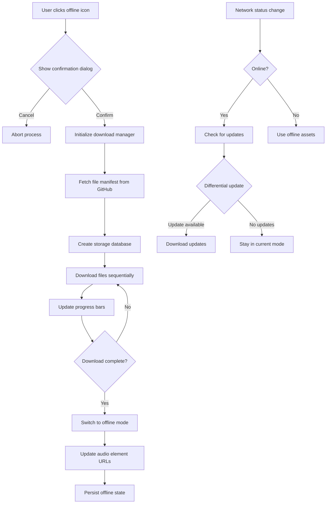

# Offline Mode Implementation Plan

## Overview
This document outlines the implementation plan for adding runtime offline mode functionality to the Six Senses Meditation Course website. The feature will allow users to download audio files and other assets dynamically, providing complete offline access.

## Current State Analysis

### Audio Files to Download
The website references 37 audio files from GitHub Releases:
- 01-01-coming-back-to-your-senses.mp3
- 01-02-sense-of-sight.mp3
- 01-03-sense-of-hearing.mp3
- 01-04-sense-of-smell.mp3
- 01-05-sense-of-taste.mp3
- 01-06-sense-of-touch.mp3
- 01-07-sense-of-mind.mp3
- 02-01-open-awareness.mp3
- 02-02-name-the-channel.mp3
- 02-03-dual-experiences.mp3
- 03-01-this.mp3
- 03-02-five-obstacles.mp3
- 03-03-following-experience.mp3
- 03-04-generating-interest.mp3
- 03-05-attention-to-attention.mp3
- 04-01-internal-dependency.mp3
- 04-02-external-dependency.mp3
- 04-03-conditions-for-consciousness.mp3
- 04-04-contact.mp3
- 04-06-conditioned.mp3
- 05-01-sukha-vedana.mp3
- 05-02-dukkha-vedana.mp3
- 05-03-adukkham-asukha-vedana.mp3
- 05-04-three-types-of-vedana.mp3
- 05-05-eighteen-types-of-vedana.mp3
- 05-06-craving-aversion-and-ignorance.mp3
- 05-07-cultivating-equanimity.mp3
- 06-01-recognizing-anicca.mp3
- 06-02-vedana-anicca.mp3
- 06-03-giving-up-interest-in-anicca.mp3
- 07-01-recognizing-dukkha.mp3
- 07-02-source-of-dukkha.mp3
- 07-03-giving-up-interest-in-dukkha.mp3
- 08-01-all-experience-is-anatta.mp3
- 08-02-three-types-of-anatta.mp3
- 08-03-anicca-dukkha-anatta.mp3
- 08-04-emptiness.mp3

### External Dependencies
- GitHub Releases for audio files (https://github.com/bdhrs/meditation-course-on-the-six-senses/releases/download/audio-assets/)
- Creative Commons license image (https://licensebuttons.net/)
- Google Forms for feedback
- External CSS/JS libraries (if any)

## Implementation Plan

### 1. Offline Mode Confirmation Dialog UI
- [ ] Create modal dialog component with theme-appropriate styling
- [ ] Display warning about ~800MB download size
- [ ] Include confirmation/cancel buttons
- [ ] Add checkbox for "Don't show again" option (stored in localStorage)
- [ ] Ensure responsive design for mobile/desktop

### 2. Audio File Download System
- [ ] Create download manager service in JavaScript
- [ ] Implement two-level progress tracking:
  - Overall progress (files downloaded/total files)
  - Current file progress (bytes downloaded/total bytes)
- [ ] Design progress bar UI matching theme colors
- [ ] Add pause/resume functionality for large downloads
- [ ] Implement retry mechanism for failed downloads

### 3. Safe Storage Mechanism
- [ ] Use IndexedDB for persistent storage (avoids browser garbage collection)
- [ ] Create database schema for storing audio files with metadata:
  - File name
  - Content type
  - Size
  - Last modified date
  - ETag for update checking
- [ ] Implement fallback to Cache API if IndexedDB not available
- [ ] Add storage quota management and cleanup procedures

### 4. Asset Management System
- [ ] Create asset registry service to track offline/online state
- [ ] Implement URL rewriting system:
  - Online mode: Use GitHub URLs
  - Offline mode: Use IndexedDB/Cache URLs
- [ ] Add event system for mode changes
- [ ] Implement graceful degradation when assets unavailable

### 5. Update Checking System
- [ ] Create version manifest file on GitHub with file metadata
- [ ] Implement differential update checking using ETags/last-modified dates
- [ ] Add background sync for updates when online
- [ ] Create UI for update notifications

### 6. Service Worker Enhancements
- [ ] Extend service worker to handle dynamic caching of audio files
- [ ] Implement cache-first strategy for offline assets
- [ ] Add network-first strategy for online mode
- [ ] Create cache management for updates and expiration

### 7. Comprehensive Testing
- [ ] Test download functionality with various network conditions
- [ ] Verify offline playback of all audio files
- [ ] Test storage persistence across browser sessions
- [ ] Validate update detection and differential downloads
- [ ] Test on multiple browsers and devices

### 8. Documentation
- [ ] Add user guide for offline mode feature
- [ ] Create developer documentation for the implementation
- [ ] Update agents.md with new offline mode instructions

## Technical Architecture



## File Structure Changes

```
website_project/
├── static/
│   ├── js/
│   │   ├── offline-manager.js      # Main offline functionality
│   │   ├── download-service.js     # File download logic
│   │   ├── storage-service.js      # IndexedDB/Cache management
│   │   └── asset-manager.js        # URL rewriting and mode switching
│   └── css/
│       └── offline-mode.css        # Additional styles for offline UI
├── templates/
│   └── offline-dialog.html         # Confirmation dialog template
└── offline-manifest.json           # Local copy of file metadata
```

## Implementation Priority

1. **Phase 1**: Basic offline mode with confirmation dialog and download
2. **Phase 2**: Progress tracking and storage management
3. **Phase 3**: Update checking and differential downloads
4. **Phase 4**: Enhanced error handling and user experience
5. **Phase 5**: Comprehensive testing and documentation

## Estimated File Sizes
- Total audio files: ~800MB (37 files)
- Storage requirement: ~900MB (with metadata and overhead)
- Initial download time: ~20-60 minutes on average broadband

## Browser Compatibility
- Chrome/Edge: Full support (IndexedDB, Cache API)
- Firefox: Full support
- Safari: Full support (iOS 10+)
- Mobile browsers: Good support with storage limitations

## Next Steps
1. Review and approve this implementation plan
2. Begin Phase 1 implementation with confirmation dialog
3. Test basic download functionality
4. Iterate through phases with user feedback

This plan provides a comprehensive roadmap for implementing the offline mode feature while maintaining the existing build system functionality.